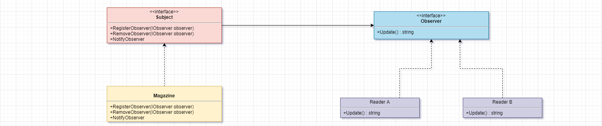

# Observer

 Observer design pattern implementation using C#

 # The idea 
We have a magazine subscription and a notice is sent to an interested reader in a particular subject  of the magazine in case a registration is sent to him an update on the magazine. 

# UML Digram
