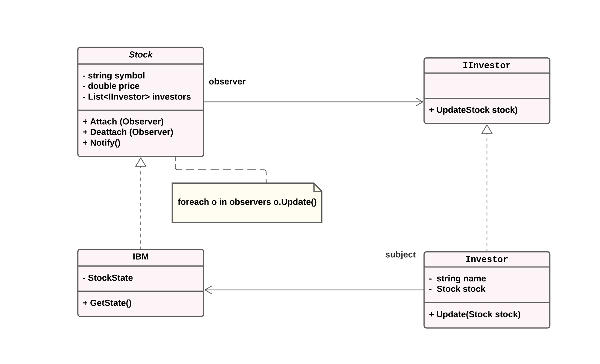

# Observer
Observer design pattern defines a one-to-many dependency between objects so that when one object changes state, all its dependents are notified and updated automatically.
This repo contains Observer design pattern implementation using C#

 

## UML 

## Output 

 

### By Samirah Alhusayni